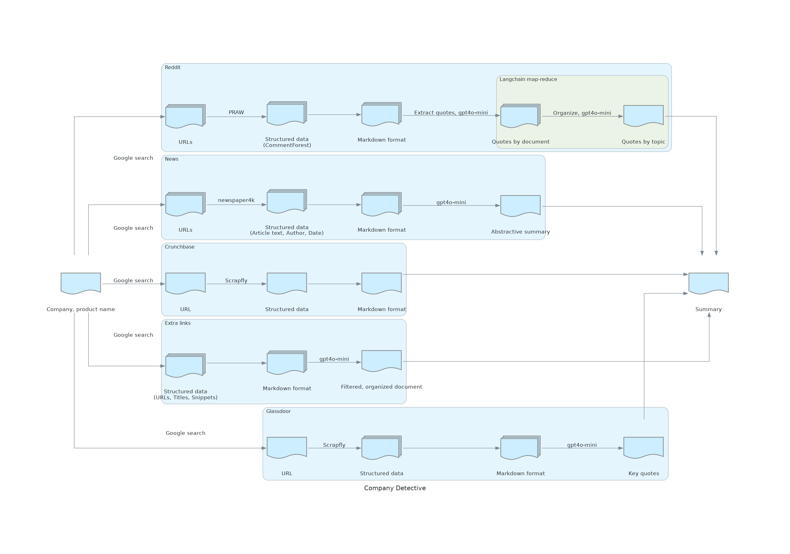

# Company Detective

This project summarizes publicly available information about a company. It leverages various APIs to gather and analyze data, providing a comprehensive overview of the target company.



## Features

- Aggregates information from multiple sources
- Utilizes AI to summarize and analyze data
- Provides a unified summary of company information

## Prerequisites

- Python 3.10 or higher
- Pipenv

## API Keys Required

This project requires API keys for the following services:

- OpenAI
- Reddit
- Google Custom Search Engine
- Scrapfly
- AWS
- Langsmith (Optional)

Ensure you have obtained the necessary API keys before proceeding with the setup.

## Installation

1. Clone the repository:
   ```
   git clone https://github.com/ktrnka/company-detective.git
   cd company-detective
   ```

2. Install dependencies using Pipenv:
   ```
   pipenv install --dev
   ```

3. Set up your API keys in a `.env` file.

## Usage

The main entry point for running the company analysis is the `src/unified_summary.ipynb` Jupyter notebook.

## Contributing

Talk to Keith! The repo isn't currently setup for open contributions yet.

## License

To be determined

