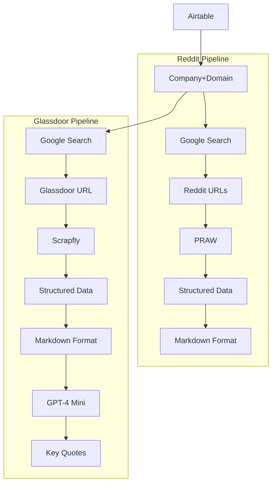

# Company Detective

This project summarizes publicly available information about a company. It leverages various APIs to gather and analyze data, providing a comprehensive overview of the target company.

Live site: https://ktrnka.github.io/company-detective

<!--  -->

<!-- 
Original non-Mermaid diagram:
with Diagram("Company Detective", show=False, filename="../system_diagram"):
    pre_source = Rack("Airtable")

    source = Document("Company, product name, domain")

    pre_source >> source

    with Cluster("Reddit"):

        reddit_markdowns = source >> Edge(label="Google search") >> MultipleDocuments("URLs") >> Edge(label="PRAW") >> MultipleDocuments("Structured data\n(CommentForest)") >> MultipleDocuments("Markdown format")

    with Cluster("Glassdoor"):
        glassdoor_summary = source >> Edge(label="Google search") >> Document("URL") >> Edge(label="Scrapfly, when it works", style="dashed") >> MultipleDocuments("Structured data") >> MultipleDocuments("Markdown format") >> Edge(label="gpt4o-mini") >> Document("Key quotes")

    with Cluster("News"):
        news_summary = source >> Edge(label="Google search") >> MultipleDocuments("URLs") >> Edge(label="newspaper4k") >> MultipleDocuments("Structured data\n(Article text, Author, Date)") >> MultipleDocuments("Markdown format") >> Edge(label="gpt4o-mini") >> Document("Abstractive summary")

    with Cluster("Company webpage"):
        webpage_summary = source >> Edge(label="Google search") >> MultipleDocuments("URLs") >> Edge(label="newspaper4k") >> MultipleDocuments("Structured data\n(Article text, Author, Date)") >> MultipleDocuments("Markdown format") >> Edge(label="gpt4o-mini") >> Document("Abstractive summary")

    with Cluster("Crunchbase"):
        crunchbase_markdown = source >> Edge(label="Google search") >> Document("URL") >> Edge(label="Scrapfly") >> Document("Structured data") >> Document("Markdown format")

    with Cluster("Extra links"):
        links = source >> Edge(label="Google search") >> MultipleDocuments("Structured data\n(URLs, Titles, Snippets)")
        extra_links = links >> MultipleDocuments("Markdown format") >> Edge(label="gpt4o-mini") >> Document("Filtered, organized document")

        with Cluster("App Stores"):
            apple_reviews = links >> Edge(label="If present", style="dashed") >> MultipleDocuments("Apple app store reviews") >> MultipleDocuments("Markdown format")
            google_reviews = links >> Edge(label="If present", style="dashed") >> MultipleDocuments("Google play store reviews") >> MultipleDocuments("Markdown format")
            steam_reviews = links >> Edge(label="If present", style="dashed") >> MultipleDocuments("Steam reviews") >> MultipleDocuments("Markdown format")

    with Cluster("Customer Experience map-reduce"):
        cx_start = MultipleDocuments("Combined reviews")
        cx_summary = cx_start >> Edge(label="Extract quotes, gpt4o-mini") >> MultipleDocuments("Quotes by document") >> Edge(label="Organize, gpt4o-mini") >> Document("Quotes by topic")

    reddit_markdowns >> cx_start
    apple_reviews >> cx_start
    google_reviews >> cx_start
    steam_reviews >> cx_start

    general_summary = Document("General Summary")
    webpage_summary >> general_summary
    news_summary >> general_summary
    crunchbase_markdown >> general_summary

    unformatted_output = Document("Combined (Json)")
    general_summary >> unformatted_output
    extra_links >> unformatted_output
    cx_summary >> unformatted_output
    glassdoor_summary >> unformatted_output

    unformatted_output >> Document("HTML") >> Github("Public pages")
    # unformatted_output >> Document("Markdown")
    

 -->



## Features

- Multiple information sources including Crunchbase, news articles, and company websites
- Utilizes AI to analyze and summarize information
- Configured via Airtable

## Prerequisites

- Python 3.11 or higher
- uv (Astral's Python package installer and resolver)

## API Keys Required

This project requires API keys for the following services:

- OpenAI
- Reddit
- Google Custom Search Engine
- Scrapfly
- AWS
- Langsmith (Optional)
- Crunchbase (via Scrapfly)
- Airtable

Ensure you have obtained the necessary API keys before proceeding with the setup. The project is designed to handle missing API keys gracefully, but functionality may be limited without them.

## Installation

1. Clone the repository:
   ```
   git clone https://github.com/ktrnka/company-detective.git
   cd company-detective
   ```

2. Install uv (if not already installed):
   ```
   make install-uv
   ```

3. Install dependencies using uv:
   ```
   make install
   ```

4. Set up your API keys in a `.env` file in the project root directory.

## Usage

The main commands for running the company analysis are:

1. To refresh company data:
   ```
   make refresh-data
   ```

2. To build the website with analyzed data:
   ```
   make build-website
   ```

3. To perform both operations sequentially:
   ```
   make build
   ```

Note: The default goal for the Makefile is set to `build`, so running `make` without arguments will execute the full build process.

## Data Sources

- Crunchbase: Provides detailed company information, funding data, and recent news.
- News Articles: Gathers recent news about the company.
- Company Website: Extracts information directly from the company's official website.
- Reddit: Collects relevant discussions and mentions of the company.
- Glassdoor: Offers employee reviews and sentiment analysis (with improved handling for small companies).
- App Reviews: 
  - Google Play Store: Scrapes up to 100 recent reviews.
  - Apple App Store: Scrapes reviews and downsamples to 100 if more are available, ensuring balanced representation with Google Play reviews.

## Contributing

Contributions are welcome but first contact Keith for more information on how to contribute, as the repository isn't currently set up for open contributions.

## Testing

The project includes automated tests. To run the tests, use:
```
make test
```

Note that some network-based tests may be skipped to avoid dependencies on external services during CI/CD processes.

## Development

To check for dead code, you can use:
```
make vulture
```

## License

To be determined. Please contact the repository owner for licensing information.

## Note

This project is under active development. Some features or data sources may change or be refactored. Please check for updates regularly.