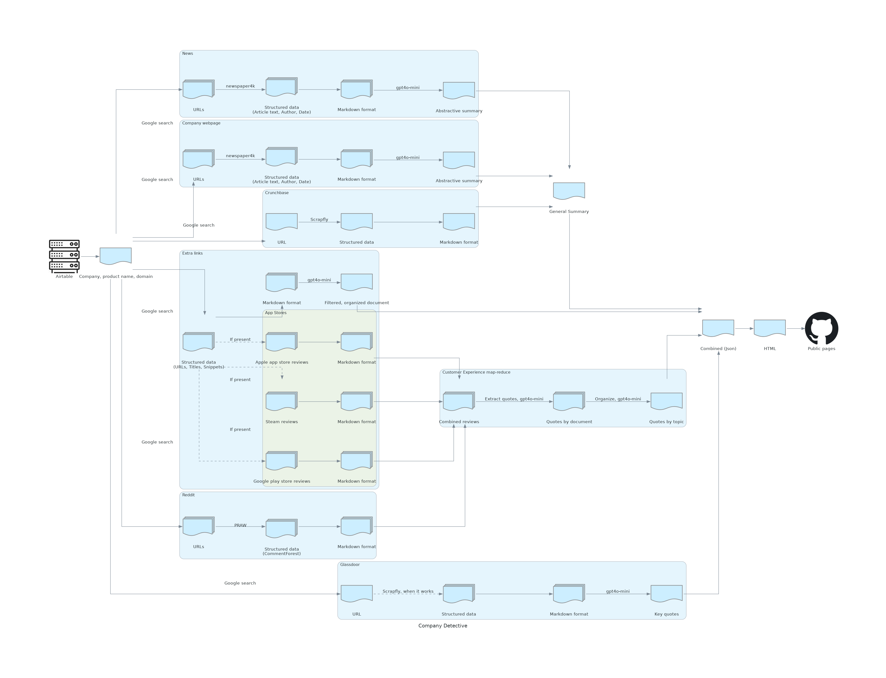

# Company Detective

This project summarizes publicly available information about a company. It leverages various APIs to gather and analyze data, providing a comprehensive overview of the target company.



## Features

- Aggregates information from multiple sources
- Utilizes AI to summarize and analyze data
- Provides a unified summary of company information
- Dynamic rebuild cadence for up-to-date information
- Cross-platform support (Python 3.10+)
- Efficient data processing and analysis

## Prerequisites

- Python 3.10 or higher
- Pipenv

## API Keys Required

This project requires API keys for the following services:

- OpenAI
- Reddit
- Google Custom Search Engine
- Scrapfly
- AWS
- Langsmith (Optional)

Ensure you have obtained the necessary API keys before proceeding with the setup.

## Installation

1. Clone the repository:
   ```
   git clone https://github.com/ktrnka/company-detective.git
   cd company-detective
   ```

2. Install dependencies using Pipenv:
   ```
   pipenv install --dev
   ```

3. Set up your API keys in a `.env` file in the project root directory. Use the following format:
   ```
   OPENAI_API_KEY=your_openai_key_here
   REDDIT_CLIENT_ID=your_reddit_client_id_here
   REDDIT_CLIENT_SECRET=your_reddit_client_secret_here
   GOOGLE_CSE_ID=your_google_cse_id_here
   GOOGLE_API_KEY=your_google_api_key_here
   SCRAPFLY_API_KEY=your_scrapfly_api_key_here
   AWS_ACCESS_KEY_ID=your_aws_access_key_id_here
   AWS_SECRET_ACCESS_KEY=your_aws_secret_access_key_here
   LANGSMITH_API_KEY=your_langsmith_api_key_here (Optional)
   ```

## Usage

The main entry points for running the company analysis are:

1. `src/notebooks/entrypoints/refresh_company_data.ipynb`: Use this notebook to refresh company data.
   - Open the notebook in a Jupyter environment
   - Update the target company information in the designated cell
   - Run all cells to fetch and process the latest data

2. `src/notebooks/entrypoints/build_website.ipynb`: Use this notebook to build the website with analyzed data.
   - Open the notebook in a Jupyter environment
   - Ensure that you have run the `refresh_company_data.ipynb` notebook first
   - Run all cells to generate the website with the latest analyzed data

## Dynamic Rebuild Cadence

The project now features a dynamic rebuild cadence, allowing for more frequent updates of company information. This ensures that the data remains current and relevant. The rebuild schedule is as follows:

- Daily: High-volatility data sources (e.g., news articles, social media)
- Weekly: Medium-volatility data sources (e.g., company websites, job postings)
- Monthly: Low-volatility data sources (e.g., annual reports, industry analyses)

You can customize the rebuild cadence by modifying the scheduling parameters in the `config.yaml` file.

## Contributing

Contributions are welcome! Please contact Keith for more information on how to contribute, as the repository isn't currently set up for open contributions. When contributing, please:

1. Fork the repository
2. Create a new branch for your feature or bug fix
3. Write tests for your changes
4. Ensure all tests pass
5. Submit a pull request with a clear description of your changes

## License

To be determined. Please contact the repository owner for licensing information.

## Note

This project is under active development. Some features or data sources may change or be refactored. Please check for updates regularly and report any issues you encounter.

## Support

If you need assistance or have any questions, please open an issue on the GitHub repository or contact the maintainers directly.